# Sneedroid

**A native Android app for SneedChat**

Sneedroid is a phone app for reading and posting in SneedChat. It signs in with your normal
 account, gets you through the proof-of-work gate automatically, and gives you a clean,
fast, mobile-first chat — with rich text, custom emotes, image upload, background notifications,
and a built-in **privacy killswitch** that stops you from ever connecting without a VPN.

> Sneedroid is an unofficial, community-built client. It isn't on the Google Play Store. Install it by downloading the app file yourself (see **Installing** at the bottom).

---

## Sign in

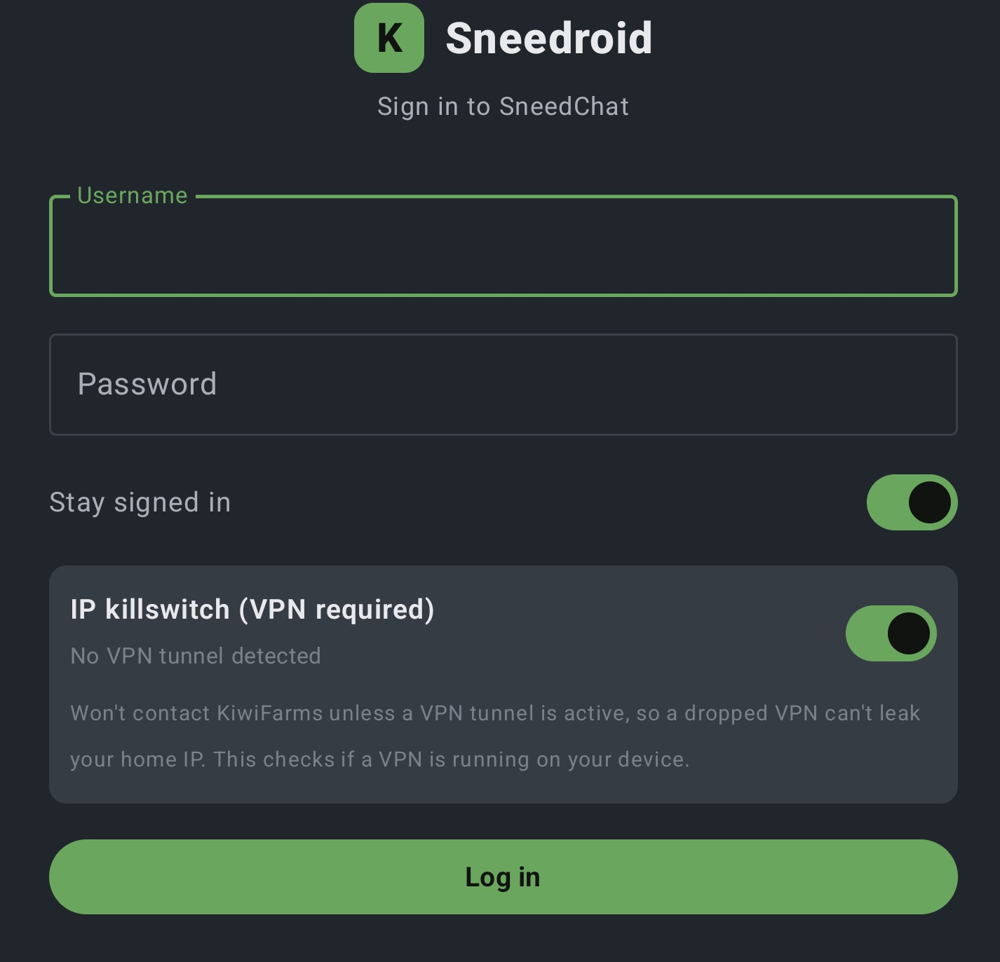

Sign in with your username and password (two-factor codes are supported too). The
**IP killswitch** toggle is available on the login screen before any network communicaton is made.[below](#privacy-the-ip-killswitch).

## Chat

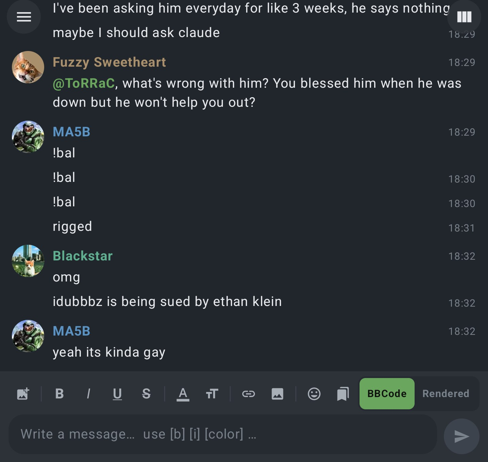

A familiar, mobile-friendly chat: avatars, colored names, mentions, quotes, inline images, dropdowns, emotes, and timestamps. It keeps you pinned to the newest message, with a "jump to latest" button
when you scroll up to read back.

## Emotes

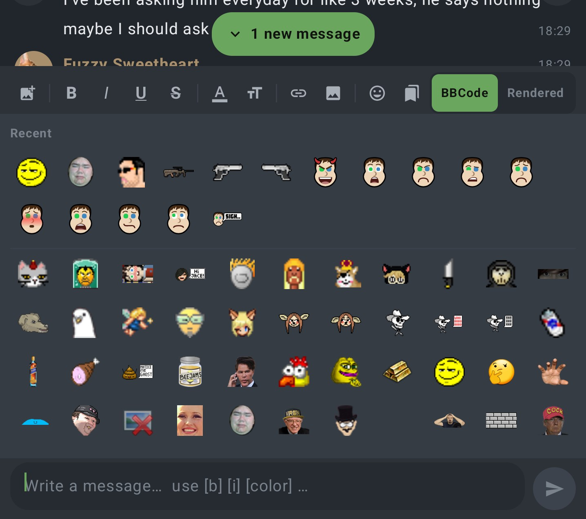

The full set of SneedChat custom emotes, with a **Recent** row at the top.

## Custom emotes & macros

Make your own one-tap shortcuts. A macro can drop in an image, a premade message, or any text
you spam a lot. This is the same as the KEES extension custom emote bar.

<p>
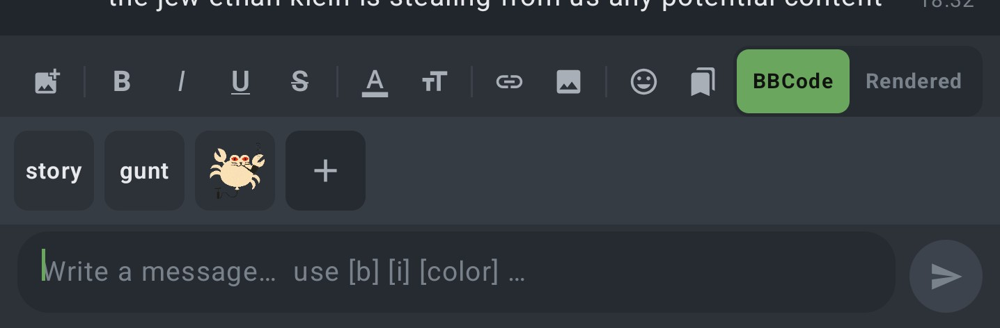
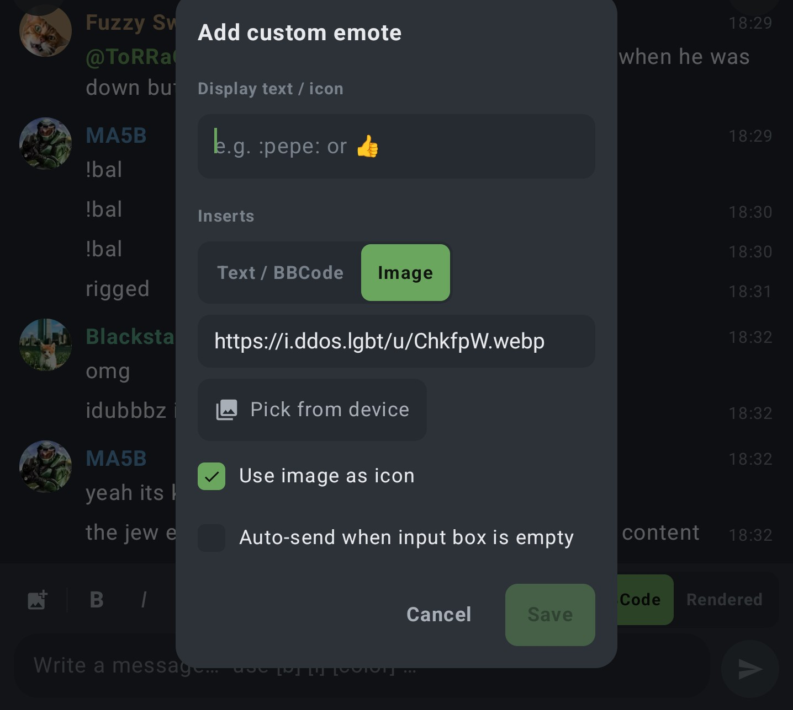
</p>

When you add one you set its icon, choose what it inserts (an image you pick from your phone or
paste a link for, or plain text/BBCode), optionally show that image as the icon, and turn on
**auto-send when the box is empty** so a single tap posts it instantly.

## Formatting — see it as you type

Two modes: **BBCode** shows the raw tags; **Rendered** shows your formatting as you type.

<p>
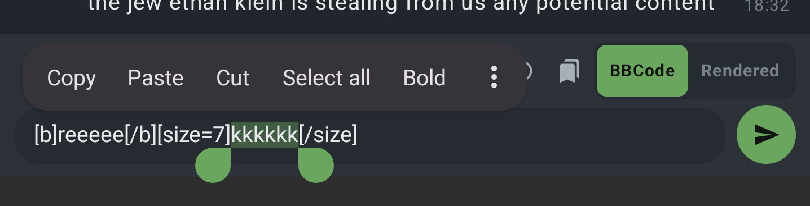
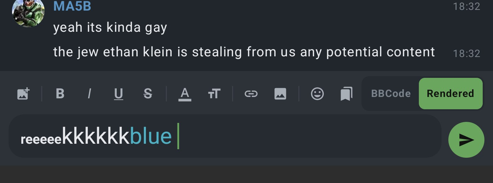
</p>

Bold, italics, underline, strikethrough, colour, size, links and images from the toolbar, by
long-pressing to select text, or by tapping a button and typing. There's a color picker (with the
classic greentext green and a custom-colour wheel) and quick size options built in. This is designed for mobile use so tapping the formatting will place the brackets around your cursor.

## Message & user actions

<p>
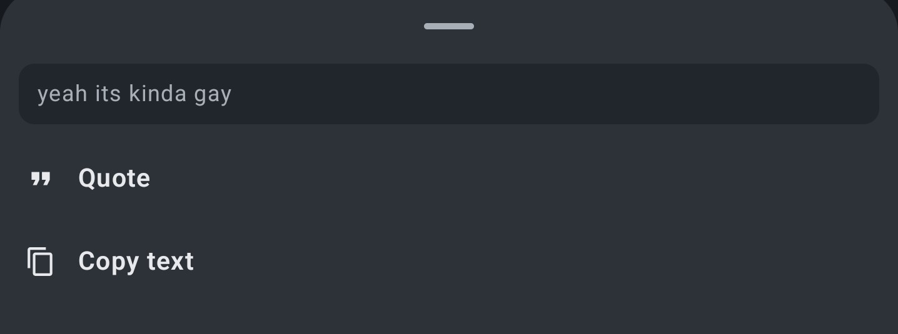
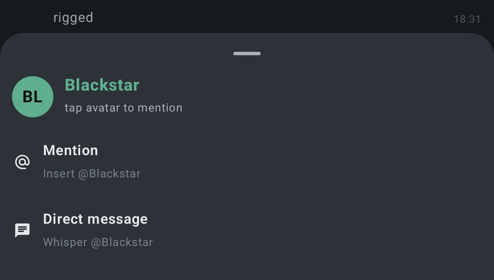
</p>

Long-press a message to quote or copy it (and edit or delete your own). Tap a name or avatar to
mention that person, open a direct message, or mute them.

## Bot feed

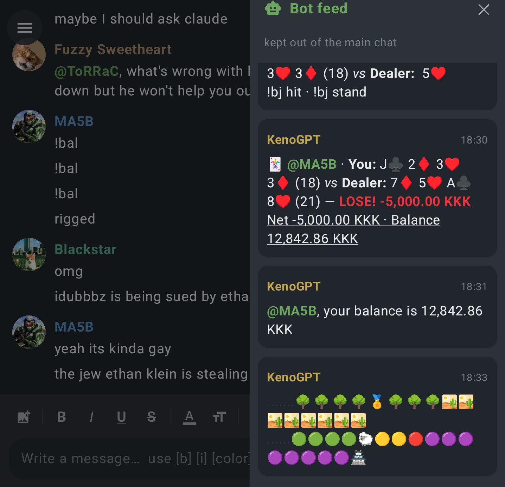

Selected bots get their own side column so the main chat stays readable. You
choose which users count as bots.

## Make it yours

Lots to tweak: message layout and density, avatar shape, timestamps, accent colour, dark mode,
notification rules, background delivery, user mutes, allowed image hosts, muted users, and image-upload setup.

<p>
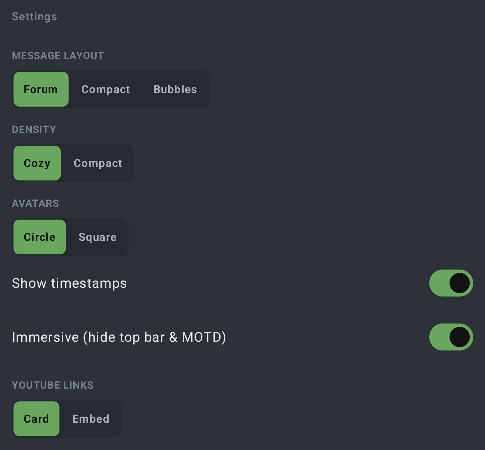
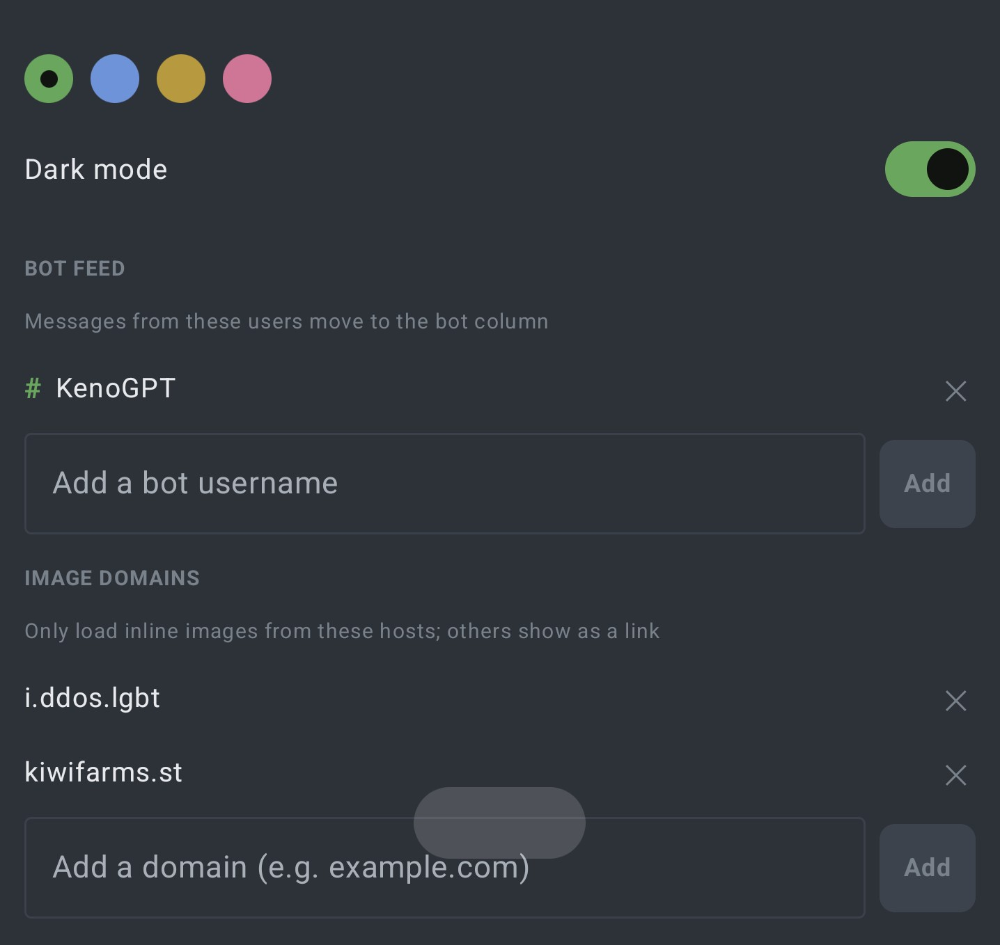
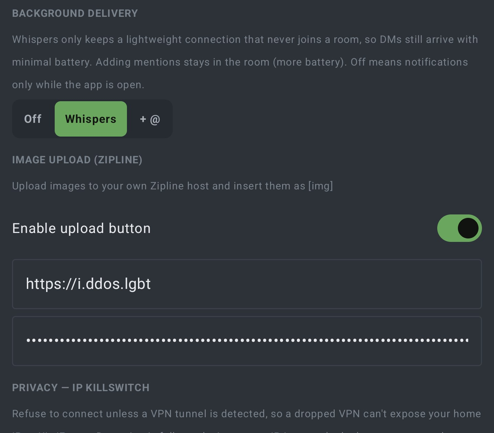
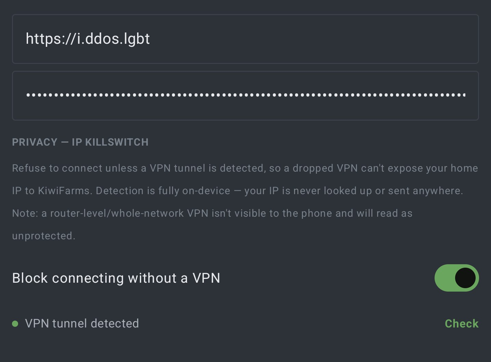
</p>

---

## Privacy: the IP killswitch


- **On = VPN required.** If no VPN is detected, the app won't make *any* connection If your VPN drops mid-session, the connection is cut rather than quietly
  falling back to your home internet.
- **Private by design.** The check runs entirely on your phone by determining whether a VPN is
  active. 
- One catch: a VPN running on your *router* (rather than the phone itself) is invisible to the
  phone.

You can flip it on the sign-in screen or in Settings, and a little indicator shows whether a VPN
tunnel is currently detected.

**For the strongest protection, also turn on Android's own killswitch:** *Settings → Network &
internet → VPN → (your VPN) → Always-on VPN* and *Block connections without VPN*. The app's
killswitch covers everything it controls (chat, sign-in, images, emotes), but only the OS-level
block also stops embedded video players and links you open in other apps from ever using your real
connection.

---

## Installing

1. Download the latest apk onto your phone from the releases page.
2. Open it (from Files or your browser's downloads). Android will ask whether to allow installing
   apps from this source — allow it for that app.
3. Tap **Install**, then open Sneedroid and sign in.

If you're updating and Android complains about a signature mismatch, uninstall the old copy first,
then install the new one — that's a normal side effect of how the app is signed.

---

## For developers

Sneedroid is Kotlin + Jetpack Compose, split into two modules:

```
core/   Pure-JVM protocol — proof-of-work solver, login, WebSocket, message parsing.
        No Android dependencies; unit-tested.
app/    The Android app (Compose UI).
```

```bash
./gradlew :core:test          # run the protocol tests (no Android SDK needed)
./gradlew :app:assembleDebug  # build the app (needs the Android SDK)
```
